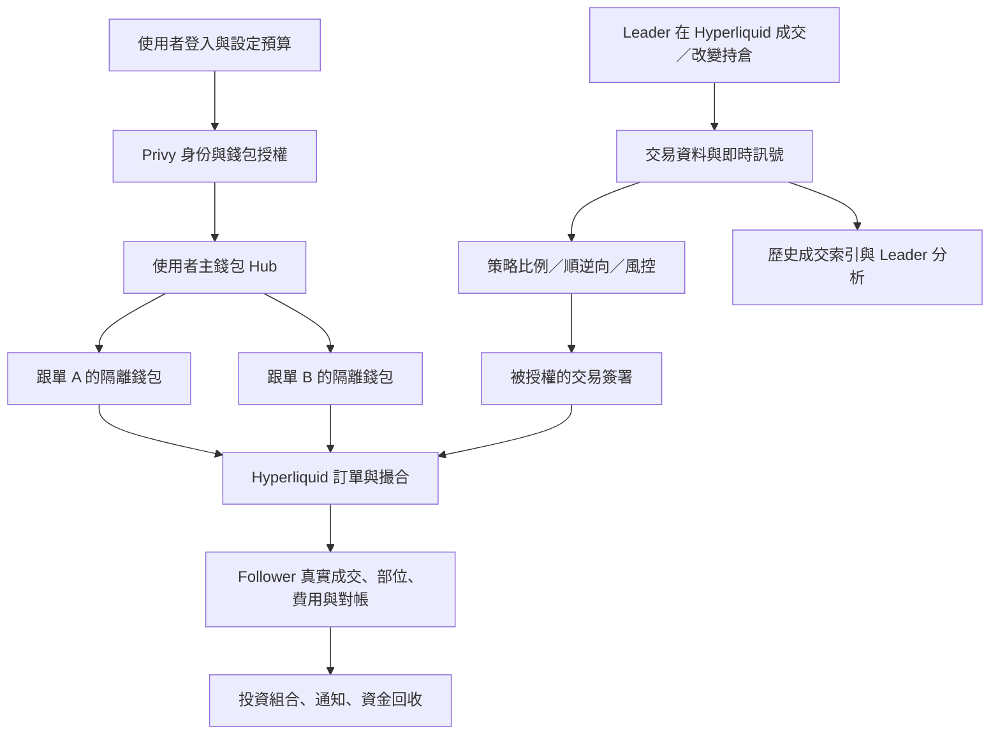

# Copydog 跟單原理與 Trading Dashboard 差異

日期：2026-10-02（Asia/Taipei）。範圍為 Hyperliquid 跟單；Polymarket 的共用程式與固定金額 UI 不直接當成 Hyperliquid 行為。

## 證據範圍

- 本輪讀取 Copydog 正式站 `/help`、`/llms.txt`，公開 API，以及最新 `index-Dp4CR15e.js`、`HLTraderDetail-BTJOJLRO.js`。
- 對照目前工作區的 auth、wallet、watcher、fill-sync、copy strategy/signal/planner/execution/risk、shared DB 與 runtime config。檢查期間 HEAD 為 `202d580`，工作區另有其他未提交 UI/SEO 調整；沒有修改這些檔案。
- 沒有登入 Copydog、檢視其 Privy 控制檯或後端、送出跟單／金流請求。公開宣稱與前端行為不是端到端資金驗收。
- 「已確認」指公開頁面、bundle 呼叫或目前本地程式；「推論」指根據這些證據建立的合理架構，無法證明 Copydog 後端逐行如此實作。

## 1. 整體架構

跟單的資料面、控制面與執行面需要分開理解。



此圖是功能分解，不是已確認的 Copydog 內部部署圖。Copydog 是交易工具，訂單在 Hyperliquid 撮合，並不由 Copydog 自己提供訂單簿。

## 2. Privy、「託管」與三種 key

Copydog 自述 non-custodial、自有錢包可匯出，App Store 說明交易 key 無法提款或轉移資金。不能因為使用 Privy server API，就直接判定所有資金為平臺託管；也不能因為私鑰沒進入應用伺服器，就斷言應用沒有交易／轉帳許可權。

需要分開的三種 key：

| 型別 | 功能 | 不代表什麼 |
| --- | --- | --- |
| 使用者錢包私鑰 | 簽署該地址可執行的動作，對應有資金的帳戶 | 不是 Privy 登入 token |
| Privy authorization key／additional signer | 授權 Privy 執行某個 wallet 的特定操作 | 不是該資金錢包的私鑰，也不是 HL agent 的同義詞 |
| Hyperliquid API／agent key | 經主帳戶批准，代表指定帳戶執行可授權交易動作 | 不是新的資金帳戶，建立 agent 不會隔離資金 |

Privy 現行 TEE 架構以加密 key shares 與 secure enclave 保護金鑰，簽署時才在 enclave 內暫時重建。錢包 owner、additional signers 與 policy 決定誰能請求哪些動作。此為 Privy 官方架構，不能只從 Copydog 打包了某 SDK，就斷言它的每個 wallet 都使用相同設定或同一代執行模式。

離線執行可採 user-owned wallet＋server additional signer＋限制政策，或由主錢包批准 HL agent 後，後端使用 agent 交易。兩者能組合使用，也能負責不同階段。Copydog 公開材料支援「使用者可匯出」與「交易 key 不可提款」的設計，但沒有公開完整 owner/signers/policy 與 agent 管理方式。本輪未在應用特定前端邏輯確認 additional signer 授權；SDK 內出現相關字串不是證據。

自動跟單需要人在離線時也能用的授權。`noPromptOnSignature` 是前端 UX 設定，不等於已建立後端離線授權；JWT 僅驗證身份，亦不等於交易授權。

## 3. 主錢包與每筆隔離跟單錢包

已確認的前端結構有 `vault_wallet_id`、投資組合 `per_account[]`，匯出頁讀取 `GET /api/account/wallets`，按 `exportable` 篩選、`kind=hub` 標主帳戶，並對選中的地址呼叫 Privy `exportWallet({address})`。

合理資金模型：主錢包處理入金與對外提款；每個 copy config 使用自己的交易錢包及預算。A leader 的 ETH 多倉和 B leader 的 ETH 空倉因帳戶不同，不在同一帳戶淨額抵銷。平臺投資組合則彙總帳戶價值並顯示對沖提示。

注意：`hl-vault` 是 Copydog API 名稱，不能直接等同 Hyperliquid 公開 Vault、HL 原生 subaccount 或收益金庫；公開 UI 更支援「獨立可匯出的錢包」。哪一層持有 owner／交易授權仍需額外證據。

## 4. 入金、建立跟單與資金狀態

目前 Hyperliquid widget 送出的核心引數為：

```json
{
  "trader_address": "0x...",
  "platform": "hyperliquid",
  "allocation_mode": "ratio",
  "allocation_amount": 500,
  "max_total_exposure": null,
  "max_leverage": null,
  "copy_direction": "same",
  "copy_start_mode": "adopt"
}
```

送到 `POST /api/copy-trading/configure`。Hyperliquid UI 使用 ratio；共用 bundle 有 fixed，不足以證明本路徑提供 fixed 模式。`null` 上限亦不等於後端完全無風控。

最低 allocation 公開為 $100。前端處理 `funding_error_code`、`insufficient_main_balance`、`awaiting_credit_confirmation`、`funding=pending`；投資組合區分 `needs_deposit`／`funding`／`paused`／`sweeping`。因此「建立 config 成功」與「錢包已收到錢且可下單」是不同事件。

入金路線可見 `wallet/deposit-info`、`wallet/universal-address`、`wallet/onramp-url`，以及 Privy funding UI；前端證明有跨鏈／刷卡入口，沒有證明每個支付商與橋接步驟的後端實現。

跟單內加碼：`POST /api/copy-trading/hl-vault/{id}/topup`。
領回可用保證金：`POST /api/copy-trading/hl-vault/{id}/withdraw`；支援 `no_free_collateral`。
對外提款：`POST /api/hyperliquid/wallet/withdraw`。

這些金流呼叫可附 `idempotency_key`；configure 的本次公開 payload 沒看到該欄位，不應泛稱所有 API 都已證明具備同一機制。HTTP timeout／5xx 可能是後端已執行但回覆遺失，前端因此提示先看投資組合，不能把 timeout 當成「未交易」。

停止有 configuration DELETE 與 `/stop-and-close` 不同入口，另有手動 `/close-hl-position`；要分開「停止新訊號」「平現有倉」「掃回資金」。FAQ 關於可保留持倉與停止平倉的敘述不同，應以選定動作與實際回報驗收，不宣稱任何 stop 都必然平掉全部。

## 5. 訊號與倉位複製

Copydog 宣稱即時偵測；公開索引宣稱自己由 raw fills 重建 round trips。尚無足夠證據確定其後端用 Hyperliquid userFills、per-market trades、自建節點、商用索引服務或多種混合，也沒有公開可驗證 P50／P95 latency。

可靠訊號需含 leader、market/dex、tid／oid、成交時間、買賣方向、成交數量與價格、成交前倉位。`side=B` 不一定是開多：也可能平空。HL fills 的 `startPosition` 讓分類更可靠。

例：原本 +2 ETH，賣 3 ETH，必須拆成平 2 ETH 多倉＋開 1 ETH 空倉。只把 sell 對應到「開空」會算錯。Leader 平 25% 時，follower 通常減自己的策略倉 25%，不直接照抄 leader 的絕對數量。順向保留方向；反向對調方向，但仍需要 follower 自己的部位帳。

按權益比例的合理模型（也是目前 Orbie 的實作，Copydog 後端精確公式未公開驗證）：

`Follower 新增名目 = Leader 此次新增名目 × Follower 策略權益 / Leader 有效權益`

Leader 權益 $100,000，買入名目 $20,000；follower 策略 $500，則名目約 $100。這裡 allocation 是策略資本，不是每次訂單名目。要區分帳戶有效權益、可用保證金、單市場保證金與實際槓桿。

`adopt` 是現在建立現有曝險，成交價是現在的市場價，不是 leader 過去進場價；`delta` 只從啟動之後的新動作開始。正確實作需要 snapshot 時間點與訊號 cursor，避免快照與新成交重複或漏接。啟動後重新連線、partial fill、TWAP 與遲到訊號亦需去重與持續對帳。這些是執行系統的必要問題，不代表已看見 Copydog 每項內部解法。

## 6. 下單與實際成交

一個真實 executor 需要識別 asset ID/dex、精度、最小名目、槓桿／保證金模式，再簽單、送 `/exchange`，接受 filled／partial／rejected／unknown 回報，並存實際 follower fills。

HL 有 L1 action 與 user-signed action 不同簽署格式。API wallet nonce 按 signer 管理，同一 signer 的不同策略／子帳戶仍共享 nonce 空間。DB 去重不是外部訂單 exactly-once 保證，HTTP 無回覆時需按 oid／cloid 查單而非盲目重送。

市場跟單本質上在 leader 動作之後成交，報酬會受偵測、確認、排隊、簽署、傳輸、撮合延遲及深度影響。IOC 是常見可行方式，但本輪不能確認 Copydog 具體採用的 TIF、滑價引數或重試演演算法。

Copydog 公開表示 crypto 與 xyz 股票／商品永續皆可跟；這要求不同 dex 的倉位、價格、資產精度及帳戶模式都一致處理，而非只在 UI 顯示股票名稱。

## 7. 費用與績效來源

Copydog 公開 builder fee 為成交名目 0.1%，與 HL 自身交易費另計。HL `approveBuilderFee` 需要主錢包授權，agent 不可代作該授權；訂單 builder f 用 0.1 bp 單位，0.1% 對應 `f=100`。例如名目 $5,000，builder $5；若當次 taker fee 為 0.045%，另付 $2.25；等名目開平各一次共 $14.50，未含 funding／滑價。HL 費率會按市場／帳戶條件變動，0.045% 不是所有場景保證。

讀取真實 HL fill 時 `fee` 已包含可選 `builderFee`，不能在總手續費再把 builder 重加。Orbie 模擬模型則自行計算 taker 與 builder 兩項後相加，這本身不是重複計費，因輸入語義不同。

資料應分三套：原始成交 ledger；以 fills 重建的 round trips（勝率、交易數、持倉期間、每幣績效）；帳戶 portfolio／equity 時間序列（ROI、Sharpe、回撤）。正在跟單的 follower 績效再獨立使用其實際成交、費用、funding 與現金流，不能用 leader 曲線代替。

Copydog llms 自述 ROI 以淨入金高水位為分母、主要交易績效為永續、帳戶價值為整帳戶。Copy Score 自述為活躍母體百分位，ROI/Sharpe/PnL/期間權重 30/30/20/20。這是公開方法說明，未證明完整篩選、winsorization、ranking 等每項細節。

HL 官方 REST `userFillsByTime` 一次最多 2,000 且僅保證最近 10,000 fills；要長期歷史必須自行儲存、封存或其他資料來源。Copydog llms 自述約 15M round trips／17.6k wallets，與本輪 live stats 23,207 wallets 口徑／更新時間不同，不能當成同一份同時快照。

## 8. 我們目前已有的基礎

- Privy 登入、embedded wallet 建立、JWT 驗證、地址同步、前端簽署與 Privy 私鑰匯出；後端 wallet API 目前讀取餘額／歷史。
- 純模擬的 strategy、版本、紙上資金帳、部位與 ledger。
- per-market trades 發現動作；REST 確認 canonical fills；跟單 execution outbox 與通知 action outbox 獨立。
- `(strategy, tid, leg)` 去重、啟動 cursor／catch-up、翻倉拆腿、順逆向、比例／fixed sizing、減倉與 reduce-only。
- DB transaction 下的風控與 reservation；策略／使用者／平臺控制；暫停、恢復、停止及 admin 介面。
- mid 加模擬滑價、taker／builder 費用、funding 估算與重啟恢復。

舊 09-30 檔案「沒有策略 DB、CopyPanel 不送請求」已不適用。

## 9. 核心不一致處與優先度

| 區域 | 目前現況 | 與真實跟單的差距 |
| --- | --- | --- |
| 可執行模式 | enums 有 testnet/live 預留，但 runtime 拒絕 | 不能只改 env 變真實下單 |
| Wallet/授權 | 一個使用者主錢包＋虛擬策略 ledger | 缺每筆 copy 錢包、owner/signer/agent 關聯、授權／撤銷生命週期與資金操作 |
| Funding | 模擬餘額立即扣款；不足回 409 | 缺等待入金、確認到賬、自動啟用、掃款與閒置保證金提款 |
| Signal 延遲 | 首次 confirm 等 2s；同地址 confirm 間隔至少 15s；copy worker 預設 2s | 這些排程加 REST 延遲，不能宣稱毫秒級。引數可因配置不同；此為程式預設，不是已量測端到端 SLA |
| Real orders | `risk_approved→submitting→模擬 filled` | 缺真實 signer／nonce、外部 send、query、unknown 恢復、撮合 partial 與對帳 |
| Leverage | effectiveLeverage 取平臺/策略/市場上限；預設平臺 10、策略曝險 fallback allocation×5 | 不是複製 leader 當時 margin/leverage 設定；即使名目相同，保證金與 liquidation 行為仍可能不同 |
| HIP-3 | allowHip3 false；mids/universe 與 adopt snapshot 主 dex | 股票現有倉採用、價格、精度與成交不可完整對齊 |
| Paper economics | mid±5bp 預設、taker 4.5bp、funding 當前率補漏時數 | 不是真實深度／部分成交；funding 不精確歷史回放；無完整強平模型 |
| Fees | 有模擬 builder 計算、收入讀取 | 缺 copy wallet builder 主錢包 approval 與真實 orders 收費／fills 對賬 |
| Notifications/UI | 收藏提醒、模擬部位與訂單 | 缺 follow-copy portfolio events、交易 bot、資金事件與真實績效曲線 |
| Historical data | pool 1,136；交易帳 247 | Copydog live wallet stats 23,207，歷史覆蓋及候選母體仍不同 |
| Scoring | Copydog 分數擬合固定 logistic 曲線；Bholu 本輪 94 對 98 | 不是活躍交易員百分位；不可把擬合版本當原演算法 |

持倉顯示還有 `pnlPct()` 名目分母與 Copydog ROE 差異，詳見前次 current audit；這不只是排版問題。

更新先前洞察觀察：21:57 左右僅 1 個有效錢包／100% 做多，**本輪重讀已恢復 walletCount=146、memberCount=150、longPct=42.2%**。此前是觀測時的freshness/覆蓋異常，未確定原因，不再作為「目前仍只有1人」結論。母體／歷史與 Copydog 仍不同。

建議依賴順序：先定每策略錢包與 owner/agent 授權模型；接資金狀態機；實作 testnet executor 與 nonce／unknown／reconciliation；再補多 dex 與 leader leverage 語義、低延遲 canonical signal、完整 follower economics 和 notifications。分析/榜單資料覆蓋可獨立推進。

## 來源

- [Copydog FAQ](https://copydog.xyz/help)、[公開資料說明](https://copydog.xyz/llms.txt)、[私鑰匯出頁](https://copydog.xyz/export)。
- [本輪 main bundle](https://copydog.xyz/assets/index-Dp4CR15e.js)、[本輪 trader chunk](https://copydog.xyz/assets/HLTraderDetail-BTJOJLRO.js)。
- [Copydog 官方 App Store 說明](https://apps.apple.com/es/app/copydog-copytrade-hyperliquid/id6787163673)。
- [Privy Secure enclaves](https://docs.privy.io/security/wallet-infrastructure/secure-enclaves)、[Policies and controls](https://docs.privy.io/security/wallet-infrastructure/policy-and-controls)。
- [Privy Offline actions](https://docs.privy.io/controls/authorization-keys/owners/configuration/user/offline)、[Delegation](https://docs.privy.io/controls/common-use-cases/delegation)。
- [HL WebSocket](https://hyperliquid.gitbook.io/hyperliquid-docs/for-developers/api/websocket/subscriptions)、[Nonces/API wallets](https://hyperliquid.gitbook.io/hyperliquid-docs/for-developers/api/nonces-and-api-wallets)。
- [HL Info](https://hyperliquid.gitbook.io/hyperliquid-docs/for-developers/api/info-endpoint)、[Exchange](https://hyperliquid.gitbook.io/hyperliquid-docs/for-developers/api/exchange-endpoint)、[Signing](https://hyperliquid.gitbook.io/hyperliquid-docs/for-developers/api/signing)、[Builder codes](https://hyperliquid.gitbook.io/hyperliquid-docs/trading/builder-codes)。
